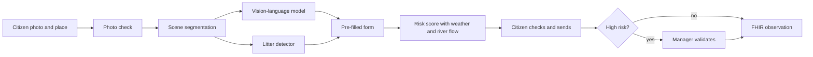

# StreamSentinel

**From a single stream photo, AI pre-fills the OneAquaHealth citizen form and estimates health risks for people and animals.**

Built for the OneAquaHealth IEEE Global Hackathon 2026, Track 3 (AI-Supported Assessment).

**Live demo:** https://streamsentinel.streamlit.app
**Video:** https://youtu.be/zewKEfzgH8U
**Project report:** [StreamSentinel_report.pdf](StreamSentinel_report.pdf)

## Context

OneAquaHealth is a European research project funded by Horizon Europe from 2023 to 2026. It is coordinated by the University of Coimbra, with partners in 10 countries. The project studies how the health of urban streams is linked to the health of people and animals. This is called the One Health approach.

Part of the project relies on citizen science. Volunteers take photos of a stream and fill in an observation form in the OneAquaHealth app. The form asks about the water colour, foam, litter, the banks and the vegetation.

The OneAquaHealth IEEE Global Hackathon 2026 asked teams to improve this citizen monitoring. Track 3, AI-Supported Assessment, was about using AI to help citizens produce reliable observations. StreamSentinel is our answer to this track. It is a prototype built in about a month.

Polluted urban streams can expose people and animals to toxic algae, sewage or dangerous currents. Reliable observations from many citizens can help local authorities detect these problems earlier.

### Key terms

J stands for "jour", which means day in French. Each step of the pipeline was built in one day, in its own notebook. A vision-language model is an AI model that looks at an image and answers questions about it in text. FHIR is the international standard for sharing health data. We use it to export the validated observations.

## The problem

Some questions of the form are difficult for a non-expert, so the data sent by citizens is often uneven and hard to use.

StreamSentinel looks at the citizen's photo and pre-fills part of the form. On unseen photos, it pre-fills 61% of the questions. The citizen checks these answers and fills in the rest.

It also estimates a risk level for people and for animals, using the photo together with live weather and river flow data. No alert is sent without the validation of a stream manager. The validated observations are then shared with researchers and health systems in a standard format.

## How it works

We did not train a big model from scratch. The pipeline combines pretrained models, image processing and one small detector that we fine-tuned. The notebooks are in the `notebooks` folder.

| Day | What it does | Main tools |
|---|---|---|
| J1 | Checks photo quality and segments the scene (water, vegetation, buildings) | SegFormer, OpenCV |
| J2 | Checks that the photo really shows a stream | CLIP |
| J3 | Detects litter and other objects | YOLO11s fine-tuned, OWLv2 |
| J4 | Pre-fills the form with the real OneAquaHealth answer codes | Qwen2.5-VL-3B |
| J5 | Computes the risk for people and animals | Open-Meteo, Hub'Eau |
| J6 | Fixes the errors found in J4 | Changes in the J4 notebook |

When the model is not sure, it answers NOT_SURE instead of guessing. The question is then left to the citizen.



## Results

We first measured our models on the photos we used to build them. The numbers looked good, but they were too optimistic. So we built independent test sets with photos the models had never seen, and we annotated them by hand.

| Model | Test set | Result |
|---|---|---|
| Form pre-filling (J4) | 21 unseen Wikimedia photos | 71% of answers correct (95% CI 62 to 80%), 61% of questions pre-filled |
| Stream check (J2) | 66 unseen Wikimedia photos | 92% of streams accepted, 79% of off-topic photos rejected |
| Litter detector (J3) | 382 external images | precision 0.77, recall 0.43 |

The litter detector reached a mAP50 of 0.796 on its own validation set of 599 images. On the external set it misses more than half of the litter, so "no litter detected" does not mean the stream is clean. Lowering the detection threshold did not really help (best F1 0.557 against 0.548), so we kept it at 0.25.

Some questions are answered well. Bank type was right 100% of the time and water appearance 89% of the time. Others were close to chance. The model almost never answers the hardest questions, like sewage discharge or vegetation cuts, and we think this is the right behaviour.

The notebooks, the annotations and the raw outputs of the evaluation are in the `evaluation` folder.

## What we changed after the evaluation

For four questions, the accuracy was not better than chance. These are channel shape, vegetation on the left bank, vegetation on the right bank and the overall condition. The AI no longer pre-fills them, and the citizen answers them alone. The model still computes them in the background, so they can be switched back on if a better model passes the test.

We measured the accuracy of the left and right banks together. With so few photos, a difference between the two sides would most likely be noise.

## Risk score

The risk score adds points for each signal the pipeline sees, like foam, abnormal colour, sewage discharge, litter, a dead animal, recent rain or a very high river flow. There is one score for people and one for animals, because dogs are more exposed to algal toxins and people are more exposed to strong currents.

Each rule is linked to the OneAquaHealth Key Indicators Factsheets when they support it. For example, the fecal coliforms and pathogens factsheets explain why sewage discharge is a health risk, and the diatoms factsheet explains why an abnormal water colour can mean a toxic algal bloom. The factsheets do not give thresholds for photo observations. So the points and thresholds are our own choices, and the app says so. Rules with no factsheet behind them are marked as team assumptions.

A low risk gives a simple safety tip. A high risk goes to the manager's queue.

## The app

The app has two roles and one transparency page.

1. **Report a stream, for citizens.** The citizen chooses a photo and the place, on a map of the 106 OneAquaHealth research sites. The form then opens in six steps, like the official app. Under each answer, a tag shows if it was suggested by the AI, changed by the citizen or left for the citizen. At the end, the citizen sees the risk, sends the observation and can download it in FHIR.
2. **Validation queue, for managers.** High risk observations wait here. The manager sees the photo, the rules behind the score and the citizen's corrections, then validates or rejects the alert. A validated observation is exported in FHIR with the status final.
3. **How the AI decides, about the AI.** Every answer the AI proposed on our test set, with its confidence, its source and its reason. This page only shows, it never changes an observation.

**Demo mode.** The live analysis of a new photo needs a GPU, which we only switch on for demo sessions. When the GPU is off, the online app offers photos that our pipeline analysed in advance. The form answers are the real outputs of the AI on these photos. The risk is computed live, with the current weather and river flow of the place. For the simulation, each sample photo is placed at a OneAquaHealth research site.

Observations are exported as FHIR R4, following the draft OneAquaHealth implementation guide (hl7-eu/oah). The export also includes the answer codes used by the OneAquaHealth app.

## From prototype to real use

StreamSentinel is built to plug into the existing OneAquaHealth tools, not to replace them.

1. The OneAquaHealth citizen app sends the photo and the place to the StreamSentinel analysis, which is a simple web API.
2. The API answers with the pre-filled form, using the exact answer codes of the app. The citizen checks it in the app, as today.
3. The validated observation goes back as a FHIR resource, which health and research systems can read directly.

The analysis takes about 35 seconds per photo on a small T4 GPU, so one GPU can handle around a hundred photos per hour. For permanent use, the API would move from Colab to a hosted GPU service. The `notebooks/API_streamsentinel.ipynb` notebook already contains the full API.

## Limits

The test sets are small, about 20 to 70 photos. The confidence intervals are wide and the results should be read as a first estimate.

The J4 test set was annotated by one person only, so we could not measure the agreement between two annotators.

Wide and calm rivers are sometimes taken for lakes by CLIP, and some open landscapes like the sea pass the stream check.

Hub'Eau river flow data only exists in France. In the other OneAquaHealth cities, the risk uses the weather only.

Face blurring for privacy is planned in the pipeline but not active yet.

The live analysis needs a GPU. We run it in Google Colab and reach it through an ngrok tunnel, which is fine for a demo but not for real use.

## Run the app

```bash
pip install -r requirements.txt
python -m streamlit run app.py
```

The whole app works right away in demo mode. For the live analysis, run `notebooks/API_streamsentinel.ipynb` in Google Colab with a T4 GPU, then put its address in `.streamlit/secrets.toml` as `API_URL`.

The pipeline notebooks in `notebooks` (J1 to J5) also run in Colab. J3 needs a Roboflow API key, saved in the Colab secrets as `ROBOFLOW_API_KEY`.

## Data and credits

Test and sample photos come from Wikimedia Commons and Roboflow Universe. The licences of the evaluation photos are listed in `evaluation/credits.csv`. The litter data comes from Roboflow Universe (RF100-VL under MIT, Floating Trash Detection under CC BY 4.0). The research sites come from the OneAquaHealth ENORA API.

The risk rules cite the OneAquaHealth Key Indicators of Ecosystem and Biological Health factsheets by Schmeller et al. (2026), doi 10.5281/zenodo.20345207, under CC BY 4.0.

We used an AI coding assistant to help write and review parts of the code and the documentation. All design choices, annotations and evaluations are ours.

The list of recent changes is in `CHANGELOG.md`.

## Team

This project was built by a team of two.

- **Miryame Bendaoud**: risk score for people and animals (J5), Streamlit application (citizen form, manager validation queue, "How the AI decides" page), FHIR R4 export, analysis API on Colab GPU, deployment on Streamlit Community Cloud, independent evaluation of the models (annotation of the unseen test sets, J3 and J4 evaluations).
- **Mohamed Bendaoud** ([@momo25bend](https://github.com/momo25bend)): photo quality checks and scene segmentation (J1), stream verification with CLIP (J2), litter detection with YOLO11s and OWLv2 (J3), original repository.
- **Together**: form pre-filling with Qwen2.5-VL-3B (J4) and error corrections after evaluation (J6).

The original repository is [momo25bend/streamsentinel](https://github.com/momo25bend/streamsentinel).
